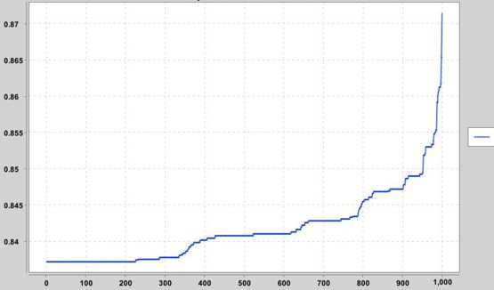

# 🚀 Memetic Algorithm for Steel Bar Cutting Optimization

This repository contains a Java implementation of a memetic algorithm designed to optimize the cutting of bars in the production process. The application addresses the Cutting Stock Problem applied to manufacturing.

---

## 📋 Project Overview

The project aims to provide an efficient solution for minimizing material consumption in the production process. By implementing a memetic algorithm, it optimizes the cutting patterns of large bars to fulfill orders of smaller bars, reducing overall costs.



### 📁 Repository Structure

├── datasets/         # Contains datasets for the application  
│   └── ...           #   (Additional datasets)  
│  
├── src/main/java/    # Java source code  
│   └── com/tesis2/algoritmos/  
│   ____    └── VentanaAlgoritmos.java # Main class to run  
│  
├── catalogo.txt      # Data file: Dictionary of data  
├── materiales.txt    # Data file: Materials data  
├── pedido.txt        # Data file: List of orders  
└── pom.xml           # Maven file  


### 📊 Data Files Description

* `catalogo.txt`:  This file contains the dictionary of data used by the application.

* `materiales.txt`: This file holds the data related to the materials used in the steel bar cutting process.

* `pedido.txt`:      This file contains a list of customer orders for steel bars.

---

## 🛠️  Installation and Setup

### 1️⃣ Prerequisites

Ensure you have Java and Maven installed. You can check the POM file for exact versions.

### 2️⃣ Clone the Repository

Clone the repository to your local machine:

```bash
git clone [https://github.com/aghersidev/algorithm-cutting-stock-optimization.git](https://github.com/aghersidev/algorithm-cutting-stock-optimization.git)
```

### 3️⃣ Compile the Project

Use Maven to download the dependencies and that's it.

### 4️⃣ Run the Application

You can run the main class directly from your IDE. In Intellij, open the project and run the src/main/java/com/tesis2/algoritmos/VentanaAlgoritmos.java class.

### ⚙️ Configuration
Ensure the data files (catalogo.txt, materiales.txt, and pedido.txt) are in an easy to reach location and set the file paths in the application. Then click Load Files.
You may need to adjust JVM memory settings if you are processing very large datasets.

### 📄 License

This project is licensed under the MIT License.

### 🤝 Contributions

Contributions to this project are welcome. Please feel free to fork the repository, make changes, and submit pull requests.   

### 💬 Support

For any issues or questions, please open an issue in the repository.
